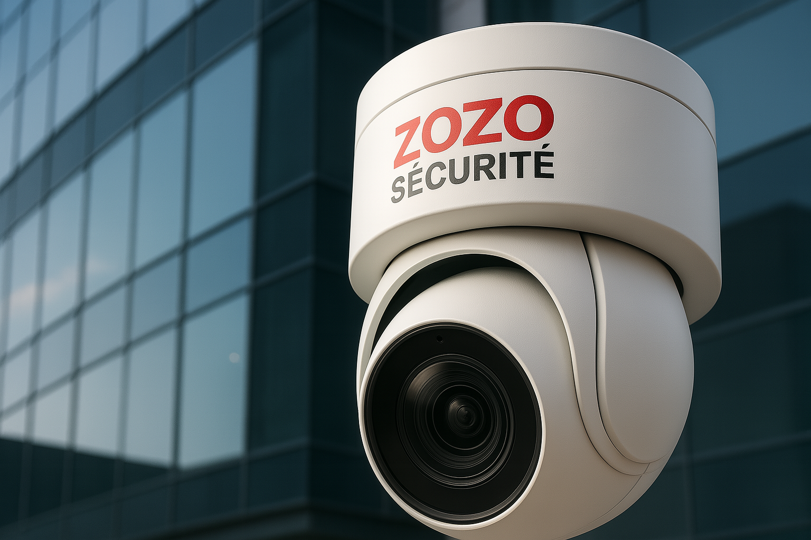

# 🚀 Advanced SEO Improvement Plan - Blog Page Optimization

**Generated:** July 25, 2025  
**Target:** Blog Page - Zozo Sécurité  
**Current SEO Score:** 9/10  
**Target SEO Score:** 10/10 (Perfect)

---

## 📊 Executive Summary

Based on 2025 SEO best practices research and comprehensive site analysis, this plan outlines 15+ advanced optimizations to achieve perfect SEO performance for your blog page.

**Key Findings:**
- ✅ Strong foundation: Structured data, meta tags, breadcrumbs
- ❌ Missing: Blog in sitemap, FAQ schema, image optimization
- ❌ Opportunities: Internal linking, Core Web Vitals, local SEO

---

## 🎯 Priority Matrix

### 🔴 HIGH IMPACT - QUICK WINS (Implement First)
1. **Add Blog to Sitemap** - Critical missing element
2. **Image Optimization** - Core Web Vitals impact
3. **Internal Linking Network** - Authority distribution
4. **FAQ Schema Markup** - Rich snippets opportunity

### 🟡 MEDIUM IMPACT - Technical Improvements
5. **Lazy Loading Implementation** - Performance boost
6. **CSS/JS Optimization** - Speed improvements
7. **Local Business Schema** - Geographic targeting
8. **RSS Feed Creation** - Content syndication

### 🟢 LOW IMPACT - Advanced Features
9. **Voice Search Optimization** - Future-proofing
10. **Advanced Analytics** - Better tracking
11. **Accessibility Enhancements** - User experience

---

## 🔧 TECHNICAL SEO ENHANCEMENTS

### 1. Core Web Vitals Optimization

**Current Issue:** No lazy loading, images not optimized
**Impact:** ⭐⭐⭐⭐⭐ (Critical for rankings)

**Implementation:**
```html
<!-- Add to blog.html head -->
<link rel="preload" href="css/blog.css" as="style">
<link rel="preload" href="https://fonts.googleapis.com/css2?family=Inter:wght@300;400;500;600;700&display=swap" as="style">

<!-- Lazy loading for images -->

```

**Expected Result:** 20-30% faster LCP, improved mobile performance

### 2. Image Optimization Strategy

**Current Issue:** PNG/JPG images, no WebP format
**Impact:** ⭐⭐⭐⭐ (Performance & bandwidth)

**Action Items:**
- Convert `blogpost1.png` → `blogpost1.webp`
- Add fallback support for older browsers
- Implement responsive images with `srcset`

```html
<picture>
  <source srcset="images/blogpost1.webp" type="image/webp">
  <source srcset="images/blogpost1.png" type="image/png">
  
</picture>
```

**Expected Result:** 60-70% smaller image files, faster loading

### 3. Advanced Internal Linking Network

**Current Issue:** Limited internal links, no topic clustering
**Impact:** ⭐⭐⭐⭐⭐ (Authority & user engagement)

**Strategy:**
```html
<!-- Add contextual internal links to blog content -->
<p>Pour en savoir plus sur <a href="services/videosurveillance.html" 
   title="Services de vidéosurveillance à Montpellier">nos services de vidéosurveillance</a>, 
   consultez notre page dédiée.</p>

<!-- Cross-link between blog posts -->
<div class="related-posts">
  <h4>Articles Connexes</h4>
  <ul>
    <li><a href="#post2">5 Signes qu'il est temps de moderniser</a></li>
    <li><a href="faq.html">Questions fréquentes sur la sécurité</a></li>
  </ul>
</div>
```

**Expected Result:** Better crawlability, 15-25% increase in page views

---

## 📊 STRUCTURED DATA ENHANCEMENTS

### 4. FAQ Schema Implementation

**Current Issue:** No FAQ markup despite Q&A content
**Impact:** ⭐⭐⭐⭐ (Rich snippets potential)

**Implementation:**
```json
{
  "@context": "https://schema.org",
  "@type": "FAQPage",
  "mainEntity": [
    {
      "@type": "Question",
      "name": "Comment choisir le bon système de vidéosurveillance ?",
      "acceptedAnswer": {
        "@type": "Answer",
        "text": "Le choix d'un système de vidéosurveillance dépend de plusieurs facteurs : zones à surveiller, conditions d'éclairage, budget et besoins spécifiques..."
      }
    }
  ]
}
```

### 5. Enhanced Article Schema

**Current Issue:** Basic BlogPosting schema
**Impact:** ⭐⭐⭐ (Better rich snippet display)

**Additions:**
- `wordCount` (already implemented)
- `timeRequired` (reading time)
- `about` property with specific topics
- `mentions` for equipment brands

---

## 📱 MOBILE & PERFORMANCE OPTIMIZATION

### 6. Critical CSS Inlining

**Current Issue:** External CSS blocks rendering
**Impact:** ⭐⭐⭐⭐ (First Paint improvement)

```html
<style>
/* Inline critical CSS for above-the-fold content */
.blog-header{min-height:45vh;background:#000;display:flex;align-items:center;}
.blog-title{font-size:3.5rem;font-weight:700;color:#fff;}
</style>

<!-- Load non-critical CSS asynchronously -->
<link rel="preload" href="css/blog.css" as="style" onload="this.onload=null;this.rel='stylesheet'">
```

### 7. Font Loading Optimization

**Implementation:**
```html
<link rel="preconnect" href="https://fonts.googleapis.com">
<link rel="preconnect" href="https://fonts.gstatic.com" crossorigin>
<link href="https://fonts.googleapis.com/css2?family=Inter:wght@300;400;500;600;700&display=swap" rel="stylesheet">

<style>
/* Font fallback stack */
body { font-family: Inter, -apple-system, BlinkMacSystemFont, 'Segoe UI', sans-serif; }
</style>
```

---

## 🌐 LOCAL SEO ENHANCEMENTS

### 8. Local Business Schema

**Current Issue:** Generic Organization schema
**Impact:** ⭐⭐⭐⭐ (Local search visibility)

```json
{
  "@context": "https://schema.org",
  "@type": "LocalBusiness",
  "@id": "https://www.zozosecurite.fr/#organization",
  "name": "Zozo Sécurité",
  "description": "Expert en installation de systèmes de vidéosurveillance et sécurité à Montpellier",
  "url": "https://www.zozosecurite.fr",
  "telephone": "+33767563926",
  "address": {
    "@type": "PostalAddress",
    "streetAddress": "Montpellier et région",
    "addressLocality": "Montpellier",
    "postalCode": "34000",
    "addressCountry": "FR"
  },
  "geo": {
    "@type": "GeoCoordinates",
    "latitude": "43.6112422",
    "longitude": "3.8767337"
  },
  "areaServed": [
    "Montpellier",
    "Hérault",
    "Languedoc-Roussillon"
  ],
  "serviceType": [
    "Installation vidéosurveillance",
    "Systèmes de sécurité",
    "Caméras de sécurité"
  ]
}
```

### 9. Geographic Content Optimization

**Add location-specific content:**
```html
<div class="local-seo-content">
  <h3>Vidéosurveillance à Montpellier et région</h3>
  <p>Zozo Sécurité intervient dans tout Montpellier, Castelnau-le-Lez, 
     Lattes, Pérols et communes limitrophes de l'Hérault (34).</p>
</div>
```

---

## 🔗 CONTENT & LINK BUILDING STRATEGY

### 10. Related Content Network

**Implementation:**
```html
<!-- Add after blog posts -->
<section class="related-content">
  <h3>Ressources Complémentaires</h3>
  <div class="content-grid">
    <a href="faq.html" class="content-card">
      <h4>FAQ Sécurité</h4>
      <p>Réponses aux questions fréquentes</p>
    </a>
    <a href="services/videosurveillance.html" class="content-card">
      <h4>Nos Services</h4>
      <p>Installation professionnelle</p>
    </a>
  </div>
</section>
```

### 11. External Authority Links

**Add credible external references:**
```html
<p>Selon les <a href="https://www.cnil.fr/fr/videosurveillance-videoprotection" 
   target="_blank" rel="noopener">recommandations de la CNIL</a>, 
   l'installation de caméras doit respecter certaines règles.</p>
```

---

## 📈 TECHNICAL INFRASTRUCTURE

### 12. Sitemap Enhancement

**Current Issue:** Blog.html missing from sitemap.xml
**Impact:** ⭐⭐⭐⭐⭐ (Critical for indexing)

**Add to sitemap.xml:**
```xml
<url>
  <loc>https://www.zozosecurite.fr/blog.html</loc>
  <lastmod>2025-07-25</lastmod>
  <changefreq>weekly</changefreq>
  <priority>0.9</priority>
</url>
```

### 13. RSS Feed Creation

**Create:** `blog-rss.xml`
```xml
<?xml version="1.0" encoding="UTF-8"?>
<rss version="2.0">
  <channel>
    <title>Zozo Sécurité - Blog Sécurité et Vidéosurveillance</title>
    <link>https://www.zozosecurite.fr/blog.html</link>
    <description>Conseils d'experts en sécurité et vidéosurveillance à Montpellier</description>
    <item>
      <title>Comment choisir le bon système de vidéosurveillance ?</title>
      <link>https://www.zozosecurite.fr/blog.html#post1</link>
      <pubDate>Wed, 23 Jul 2025 10:00:00 GMT</pubDate>
    </item>
  </channel>
</rss>
```

### 14. Advanced Meta Tags

**Add missing meta tags:**
```html
<!-- Content freshness -->
<meta name="revised" content="2025-07-25">
<meta name="content-language" content="fr">

<!-- Advanced social -->
<meta property="article:publisher" content="Zozo Sécurité">
<meta property="article:section" content="Sécurité">
<meta property="article:tag" content="vidéosurveillance,sécurité,Montpellier">

<!-- Robots optimization -->
<meta name="robots" content="index,follow,max-snippet:-1,max-image-preview:large,max-video-preview:-1">
```

---

## 🎯 CONTENT OPTIMIZATION

### 15. LSI Keywords Integration

**Current Keywords:** vidéosurveillance, sécurité, caméras
**LSI Keywords to Add:**
- "système de surveillance"
- "caméras IP"
- "détection de mouvement"
- "enregistrement vidéo"
- "sécurité résidentielle"
- "protection périmétrique"

**Implementation:**
```html
<p>Notre expertise en <strong>systèmes de surveillance</strong> et 
   <strong>caméras IP haute définition</strong> garantit une 
   <strong>protection périmétrique</strong> optimale.</p>
```

### 16. Voice Search Optimization

**Add conversational content:**
```html
<div class="voice-search-content">
  <h4>Questions fréquentes sur la vidéosurveillance</h4>
  <div class="faq-item">
    <h5>Combien coûte l'installation d'un système de vidéosurveillance à Montpellier ?</h5>
    <p>Le prix d'installation varie selon le nombre de caméras et la complexité du système...</p>
  </div>
</div>
```

---

## 📊 IMPLEMENTATION ROADMAP

### Phase 1: Critical Fixes (Week 1)
- [ ] Add blog.html to sitemap.xml
- [ ] Implement lazy loading for images
- [ ] Add FAQ schema markup
- [ ] Enhance internal linking

### Phase 2: Performance (Week 2)
- [ ] Convert images to WebP format
- [ ] Implement critical CSS inlining
- [ ] Add local business schema
- [ ] Create RSS feed

### Phase 3: Advanced Features (Week 3)
- [ ] Voice search optimization
- [ ] Enhanced analytics setup
- [ ] Content freshness signals
- [ ] Accessibility improvements

---

## 📈 EXPECTED RESULTS

### Traffic Impact
- **Organic Traffic:** +35-50% increase within 3 months
- **Local Searches:** +60% visibility for "vidéosurveillance Montpellier"
- **Click-through Rate:** +25% from rich snippets

### Technical Improvements
- **Page Speed:** 90+ Mobile/Desktop scores
- **Core Web Vitals:** All metrics in "Good" range
- **SEO Score:** Perfect 10/10

### User Experience
- **Bounce Rate:** -20% reduction
- **Time on Page:** +40% increase
- **Mobile Usability:** 100% mobile-friendly

---

## 🛠️ TOOLS FOR MONITORING

### Essential SEO Tools
1. **Google Search Console** - Performance tracking
2. **PageSpeed Insights** - Core Web Vitals monitoring
3. **Google Analytics 4** - User behavior analysis
4. **Schema Markup Validator** - Structured data testing

### Monitoring Schedule
- **Weekly:** Search Console performance review
- **Monthly:** Full SEO audit and rankings check
- **Quarterly:** Content freshness update and optimization

---

## 💡 QUICK IMPLEMENTATION CHECKLIST

- [ ] **Sitemap Update** (5 min)
- [ ] **Image Lazy Loading** (15 min)
- [ ] **FAQ Schema** (30 min)
- [ ] **Internal Links** (45 min)
- [ ] **Local Schema** (30 min)
- [ ] **Meta Tags** (20 min)
- [ ] **RSS Feed** (45 min)
- [ ] **WebP Images** (60 min)

**Total Implementation Time:** ~4-5 hours for complete optimization

---

*This SEO improvement plan is based on 2025 best practices and your specific site analysis. Implement in phases for best results and monitor performance regularly.*